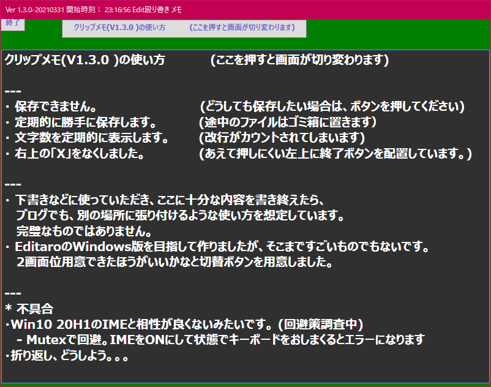
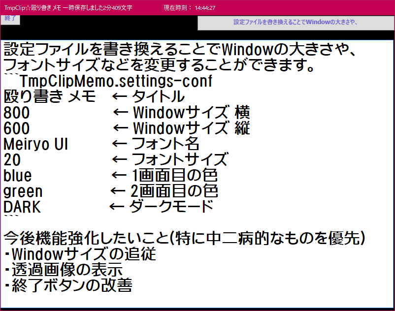

メモ帳詰め合わせ

Release.zipを展開して、実行ファイルを実行するだけです。
2種類の簡易メモ帳を同梱しています。
インターネットからのダウンロードのため、実行できない場合は、ブロックを解除してください。

************************
*  メモ帳V1
*  テンプレ対応日記帳
*  NMemoPad.exe
************************
  - 原稿を書き終えたら、保存します。
  - NMemoPad.settingsを変更することでテンプレートを変更できます。

************************
*  メモ帳V2
*  殴り書き クリップメモ
*  TmpClipMemo.exe
************************
  - Webサービスの下書きに

  - カスタマイズ可能

*  メモ帳V3
  最近はやりのメモ帳
  現在企画中で今後作るか悩み中。ここまで頑張らなくても。それなら、ありものを使えばいいでしょうし。
   - Macのメモ帳とかSimplenote風
   - ScrapBox、Todo、など

