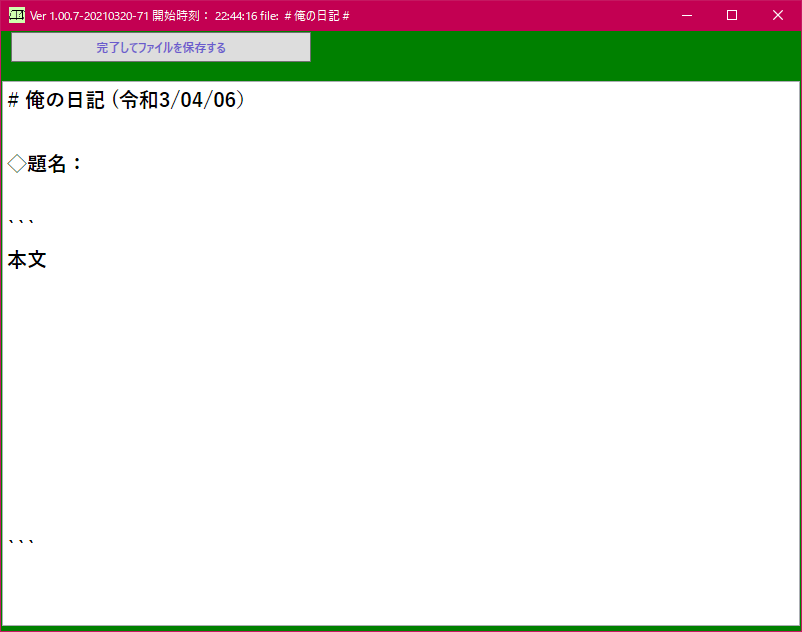

メモ帳詰め合わせ

Release.zipを展開して、実行ファイルを実行するだけです。
2種類の簡易メモ帳を同梱しています。
インターネットからのダウンロードのため、実行できない場合は、ブロックを解除してください。

************************
*  メモ帳V1 (100行くらい)
*  テンプレ対応日記帳
*  NMemoPad.exe
************************
  - 原稿を書き終えたら、保存します。
  - NMemoPad.settingsを変更することでテンプレートを変更できます。

************************
*  メモ帳V2 (300行くらい)
*  殴り書き クリップメモ
*  SimpleClipMemo.exe
************************
  - V3に機能を詰め込みすぎたので、V3から機能をそぎ落としたものです。

************************
*  メモ帳V3 (300行くらい)
*  殴り書き クリップメモ
*  TmpClipMemo.exe
************************
  - Webサービスの下書きに

  - カスタマイズ可能

  - Macのメモ帳とかSimplenote風のテキスト版を目指す？
