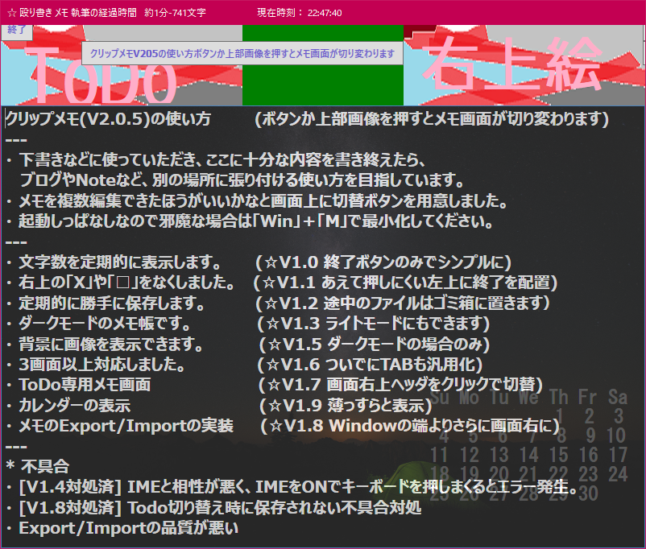
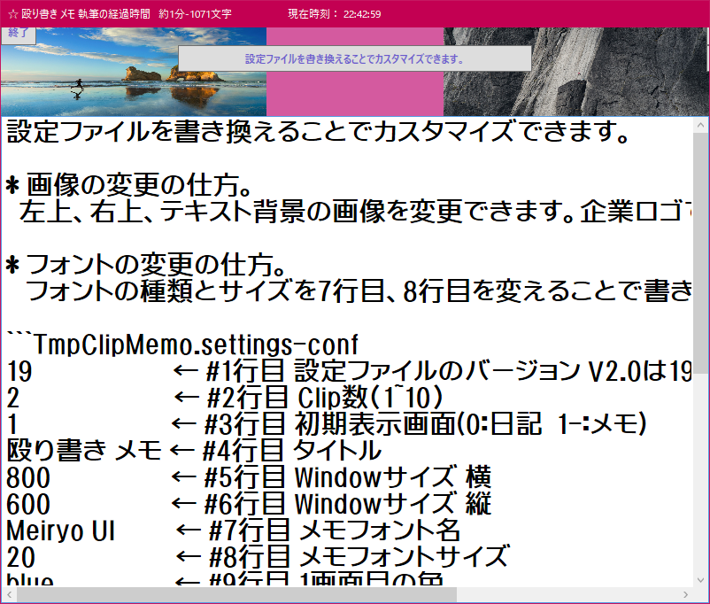

自作のメモ帳詰め合わせ
----------------------

特徴：
  見た目重視：ダークモード、背景画像、ヘッダ画像
  機能削減：メニューなし、保存操作なし

展開方法：
  Release.zipを展開して、実行ファイルを実行するだけです。
  2種類の簡易メモ帳を同梱しています。
  インターネットからのダウンロードのため、実行できない場合は、
  ブロックを解除してください。

************************************************
*  メモ帳V1 (バニラSmallbasicで100行くらいで作成)
*  テンプレ対応日記帳
*  NMemoPad.exe
************************************************
  - 原稿を書き終えたら、保存します。
  - NMemoPad.settingsを変更することでテンプレートを変更できます。

************************************************
*  メモ帳V2 (ライブラリと共に300行くらい)
*  殴り書き クリップメモ
*  SimpleClipMemo.exe
************************************************

  - Webサービスの下書きに

  - カスタマイズ可能

  - Macのメモ帳とかSimplenote風のテキスト版を目指す？

************************************************
*  メモ帳V3 (ライブラリと共に300行くらい)
*  殴り書き クリップメモ
*  TmpClipMemo.exe
************************************************
  - V2に機能を詰め込みすぎたので、V2から機能をそぎ落としたものです。
  - V2の機能肥大化から、ブラッシュアップしています。中身は一緒でアイコンと設定ファイルを変えたものです。

************************************************
*  メモ帳V3 (ライブラリと共に300行くらい)
*  殴り書き クリップメモ
*  TmpClipMemo.exe
************************************************
  - V2に機能を詰め込みすぎたので、V2から機能をそぎ落としたものです。
  - V2の機能肥大化から、ブラッシュアップしています。中身は一緒でアイコンと設定ファイルを変えたものです。

************************************************
*  メモ帳V4 (ライブラリと共に300行くらい)
*  曼荼羅系のメモパッド
*  Mandra.exe
************************************************
  - ファイル名はスペルを変えるために、「a」をとってます。
  - アイディアをまとめるように
  - 73マス分のメモを書けます。

************************************************
*  メモ帳V5 (ライブラリと共に300行くらい)
*  王様の耳はロバの耳。といってすっきりして暗号化して保存する
*  OSMNoMemo.exe
************************************************
  - 王様の耳はロバの耳。といってすっきりして暗号化して保存する
  - 日頃のストレスを吐き出して葬りましょう
  - 復元できないので注意して自己責任で使ってください。
  - 起動時に生成される画面上の乱数で暗号化しています。

************************************************
*  メモ帳V6 (ライブラリと共に400行くらい)
*  Zoomで表示するためのメモ帳
*  Zoomemo.exe
************************************************
  - Zoomで画面共有すると議論がはかどるかも。

************************************************
*  メモ帳V7 (ライブラリと共に400行くらい)
*  ビジネスフレームワークをためすメモ帳
*  FWMatrix.exe
************************************************
  - いろんなフレームワークを試して頭の中を整理しよう。
